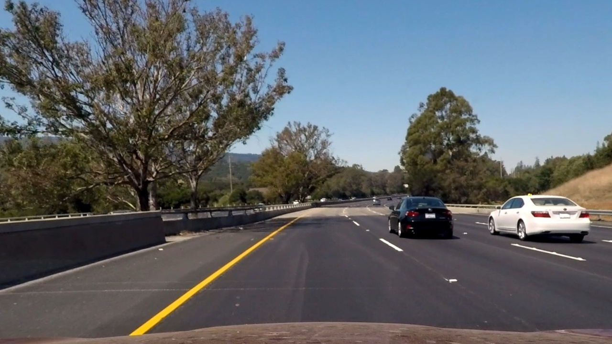

# **Advanced Lane Finding Project**

Code is under the folder `code`
Output images are under `output_images`
Output video is under `output_videos`

### The goals / steps of this project are the following:

* Compute the camera calibration matrix and distortion coefficients given a set of chessboard images.
* Apply a distortion correction to raw images.
* Use color transforms, gradients, etc., to create a thresholded binary image.
* Apply a perspective transform to rectify binary image ("birds-eye view").
* Detect lane pixels and fit to find the lane boundary.
* Determine the curvature of the lane and vehicle position with respect to center.
* Warp the detected lane boundaries back onto the original image.
* Output visual display of the lane boundaries and numerical estimation of lane curvature and vehicle position.

**Original Image**


**Undistorted Image**


**Gradient Image**


**Gradient Image**


**Top view Image**


**Fit lines Image**


**Output Image**


**Output Video**


## [Rubric](https://review.udacity.com/#!/rubrics/571/view) Points

### Here I will consider the rubric points individually and describe how I addressed each point in my implementation.

---

### Writeup / README

#### 1. Provide a Writeup / README that includes all the rubric points and how you addressed each one.  You can submit your writeup as markdown or pdf.  [Here](https://github.com/udacity/CarND-Advanced-Lane-Lines/blob/master/writeup_template.md) is a template writeup for this project you can use as a guide and a starting point.

You're reading it!

### Camera Calibration

#### 1. Briefly state how you computed the camera matrix and distortion coefficients. Provide an example of a distortion corrected calibration image.

Using the camera calibration images (chessboard images), I used the method `cv2.findChessboardCorners` to get the corners of the chessboard. This will match the corner points on the image and where there suppouse to be in the 2d image.
Having the points on the camera world (3d) and the position they should be on the 2d world/image plane, I can use `cv2.calibrateCamera` to get the calibration matrix, that will calibrate the camera/ remove the distortion (`cv2.undistort`). Although these camera images had an small distortion.

**Original Image**


**Undistorted Image**


#### 2. Describe how (and identify where in your code) you used color transforms, gradients or other methods to create a thresholded binary image.  Provide an example of a binary image result.

I transformerd the image to HLS, to get a better understanding of the shadows, this was explained on the lesson, and the results working with the shadow output is much better than the other two values. To this "shadow image", I did apply a threshold to get the values between two numbers, I did play a bit with these number I found that 130 and 2500 worked fine for detecting the lines. Also applied Sobel to the "light image", getting the X absolute X values, to filter lines with accenture on the X axis. An merging both result into one image.

**Gradient Image**


#### 3. Describe how (and identify where in your code) you performed a perspective transform and provide an example of a transformed image.

I did get the  region o interes, as always this was kind of tricky, sinse the straight_lines images had different region than the test images (or at least I found better results changing it). Having a region of interest I was able to understand the position of 4 points in image plane, that I wanted to look on the top view image (polygon to square). I used `cv2.warpPerspective` to transform those 4 points (corners of the regiong of interest) to an square, and this gave me the top view. I used a debug function to draw an actual square to understand of my region was right + the curvature of the lines or in case of an straight line validate that their were actually straight.

This resulted in the following source and destination points:

```
width = 1280
height = 720
horizon = (height/2)+90
mid_point = (width/2) + 20
multiplier = 50
left_margin = 190 - multiplier
right_margin = width - 160  + multiplier
finish = height
mid_point_left = 63 + 10
mid_point_right = 65 + 10
margin = 100
```
| Source        | Destination   |
|:-------------:|:-------------:|
| mid_point - mid_point_left, horizon		| margin, margin							|
| mid_point + mid_point_right, horizon  | width - margin, margin      |
| right_margin, finish									| width-margin, height-margin |
| left_margin,finish										| margin, height-margin       |

**Top view Image**


#### 4. Describe how (and identify where in your code) you identified lane-line pixels and fit their positions with a polynomial?

On the top view image, I did get the histogram to get the two starting points (on the images, on the video I use the previous line as starting points), having them I define a set of windows, these are going to be the areas in which I'll look for points/lines inside them (I used the values from the lessong because I didn;t have any issues with them). I start adding the non_zero values to an array, these are going to be the lines, with the mean of them (center point) I calculate the next window.  With the line points I calculate the resultant lines using `np.polyfit` and plot them/ plot the area between lines

**Fit lines Image**


#### 5. Describe how (and identify where in your code) you calculated the radius of curvature of the lane and the position of the vehicle with respect to center.

Having the polynomial values of the curvature of each line, I move them to meters (multiply by the default values of pixel by meters, I used the one that we used on the lesson), with the line on meters I used the formula to get the radius of the curvature :
```
Rcurve=((1+(2Ay+B)**2)**1.5)/ abs(2*A)
```

#### 6. Provide an example image of your result plotted back down onto the road such that the lane area is identified clearly.

To get the plotted lines back to the image, what I did is to invert the points order on the same function used to get the top view (probably using the same matrix inverted will work but I just prefered to do this). This means use the square top view points as starting point and the 3d polygon points as resultant position.

**Output Image**


---

### Pipeline (video)

For the video I found that the curvature radius was changing super fast so I start using the mean of the last 60 frames = 1 second, this makes the numbers change more smoothly (now is posible to read them), + the changes makes more sense, and there is less noise. Also found that I had to increase the region of interest, with a higher horizon line to capture more line points in order to have a more accurated curvature.

**Output Video**


---

### Discussion

#### 1. Briefly discuss any problems / issues you faced in your implementation of this project.  Where will your pipeline likely fail?  What could you do to make it more robust?

I'm not sure about the possion of the car in relation with the lines, it's hard to know if the messurements are right or not, I saw that it start a bit higher and durint the video that value gets smaller which perhaps makes sense.
Also found that writing the video was suuuuuuper slow, which made a bit hard to debug it, but probably playing a bit more with the horizon (a value like `horizon = (height/2)+90` will probably work better) + the threshold for the binary image, although at least with the project video these numbers did work really well, I found only 1 or 2 parts of the video where the noise made the left line to get a bit off, but probably changing the horizon that should be fixed.
